---
stepsCompleted:
  - step-01-init
  - step-02-discovery
  - step-03-core-experience
  - step-04-emotional-response
  - step-05-inspiration
  - step-06-design-system
  - step-07-defining-experience
  - step-08-visual-foundation
  - step-09-design-directions
  - step-10-user-journeys
  - step-11-component-strategy
  - step-12-ux-patterns
  - step-13-responsive-accessibility
  - step-14-complete
inputDocuments:
  - _bmad-output/planning-artifacts/prd.md
  - _bmad-output/planning-artifacts/architecture.md
  - _bmad-output/planning-artifacts/initial-brief.md
  - docs/Stan Store Feature Documentation.md
---

# UX Design Specification Stan-store

**Author:** Devansh bhargava
**Date:** 2026-02-10

---

## Executive Summary

### Project Vision

A mobile-first "Link-in-Bio" commerce platform for Indian creators, enabling instant monetization through frictionless UPI-powered impulse purchases. The core UX principle is "Zero Friction" — every design decision optimizes for fewer taps, faster loads, and instant gratification.

### Target Users

- **Creators:** Content entrepreneurs (coaches, designers, writers) with 1k-500k social media followers who need to monetize NOW. They are moderately tech-savvy (comfortable with Instagram, Canva, Google Docs) but have zero patience for complex dashboards.
- **Buyers:** Social media followers making impulse purchases on mobile, primarily via Instagram/LinkedIn in-app browsers. They trust the creator, not the platform. They want to pay and get the product in under 30 seconds.
- **Platform Admin:** Internal operators managing creator health, compliance, and platform-wide metrics.

### Key Design Challenges

1. **Speed-to-Value:** Creator onboarding must achieve "store live with first product" in under 5 minutes. Every extra field or step is a conversion leak.
2. **In-App Browser Constraints:** 70%+ of buyer traffic comes from Instagram/LinkedIn in-app browsers with limited capabilities. The storefront must feel native inside these constrained environments.
3. **Payment UX Complexity:** Must gracefully handle UPI Intent Flow (deep links), Dynamic QR codes, and Razorpay modal fallbacks — all from a single checkout surface.
4. **Trust Without Friction:** Buyers make impulse purchases from strangers. The UI must convey trust (clean design, receipts) without adding friction (no buyer accounts, no long forms).

### Design Opportunities

1. **"5-Minute Magic" Onboarding Wizard:** Guided, progressive-disclosure flow that feels like filling out an Instagram profile, not setting up a store.
2. **Bottom-Sheet Checkout:** A sleek, mobile-native checkout that slides up from the storefront — Name, Email, Pay. Three fields. One tap.
3. **Unified "Card" Design System:** Polymorphic product cards (Downloads, Courses, Links) share a visual language but each has distinct personality.
4. **"Money In" Dashboard:** Creator-first dashboard answering ONE question: "How much money did I make today?" Revenue front-and-center.

## Core User Experience

### Defining Experience

**Primary Loop (Buyer):** See Product → Tap "Buy" → Enter Name/Email → Pay via UPI → Receive File
- Target: < 30 seconds end-to-end
- Zero account creation, zero cart, zero friction

**Primary Loop (Creator):** Google Sign-In → Claim Handle → Add Payment → Upload Product → Publish
- Target: < 5 minutes to first published store
- Wizard-driven, progressive disclosure, mobile-friendly

### Platform Strategy

| Dimension | Decision | Rationale |
|---|---|---|
| **Primary Platform** | Mobile Web (Responsive) | 70%+ traffic from social in-app browsers |
| **Input Mode** | Touch-first | Buyers are always on mobile; creators may use desktop for dashboard |
| **Offline** | Not required | Commerce requires connectivity; no offline mode for MVP |
| **Deep Links** | Critical | UPI Intent Flow requires `upi://` deep links to payment apps |
| **PWA** | Deferred | Considered for creator dashboard in Phase 3 |

**In-App Browser Optimization:**
- No popups (blocked by Instagram browser)
- No `window.open()` for payments — use inline modals/bottom-sheets
- Minimal JavaScript bundle (< 100KB gzipped for storefront)
- Preload critical fonts and images above the fold

### Effortless Interactions

| What Should Feel Effortless | How We Achieve It |
|---|---|
| **Buying a product** | Bottom-sheet checkout: 3 fields (Name, Email, Phone), one "Pay" button |
| **Setting up a store** | Wizard that pre-fills from Google profile (name, photo) |
| **Publishing a product** | Upload file → set price → toggle "Live". No categories, no tags, no SEO fields |
| **Receiving the product** | Auto-redirect to "Thank You" page + instant email. No "check your inbox" hunting |
| **Understanding earnings** | Dashboard opens to "Today: ₹X earned". One number, front and center |

**What Should Happen Automatically (Zero User Action):**
- Store URL generated from username
- Mobile-optimized page rendered from product data
- Receipt email sent on payment success
- Signed URL generated and embedded in delivery email
- Order logged immutably for audit trail

### Critical Success Moments

| Moment | What User Feels | Make-or-Break |
|---|---|---|
| 🎉 **"Store is Live!"** | Creator sees their store URL for the first time | If it looks ugly or broken → they leave forever |
| 💰 **"₹499 Received"** | Creator gets first sale notification | If payment fails silently → trust destroyed |
| 📦 **"Download Ready"** | Buyer gets file instantly after payment | If email is delayed or link broken → chargebacks |
| ⚡ **"That was fast"** | Buyer taps pay, PhonePe opens, done in 5s | If deep link fails → confused, abandoned |

### Experience Principles

1. **"Three Taps or Less"** — Any critical user action must complete within 3 taps. If it takes more, we're adding friction.
2. **"Show, Don't Ask"** — Pre-fill, auto-detect, and use smart defaults instead of asking users for information.
3. **"Mobile is the Truth"** — Design for a 375px-wide screen in an Instagram in-app browser FIRST. Desktop is secondary.
4. **"Money Talks"** — For creators, the most important UI element is always their earnings. Revenue visibility drives retention.
5. **"Trust Through Speed"** — Fast = trustworthy. Slow = suspicious. Performance IS the UX.

## Desired Emotional Response

### Primary Emotional Goals

**For Creators:**
- **Empowered:** "I can actually do this — I'm a business owner now!"
- **Confident:** "My store looks professional. I'd buy from me."
- **Excited:** "Someone just paid me directly for my knowledge!"

**For Buyers:**
- **Trust:** "This feels legit, clean, and safe to pay."
- **Speed:** "That was so fast I barely noticed I paid."
- **Satisfaction:** "I got exactly what I wanted, instantly."

### Emotional Journey Mapping

| Stage | Creator Feels | Buyer Feels |
|---|---|---|
| **Discovery** | "This looks simple enough" (Relief) | "This looks clean and trustworthy" (Trust) |
| **First Action** | "Wow, it pre-filled my name!" (Delight) | "Just 3 fields? Nice." (Relief) |
| **Core Moment** | "My store is LIVE!" (Pride + Excitement) | "PhonePe opened instantly" (Speed) |
| **After Success** | "₹499 received!" (Validation) | "File in my inbox already" (Satisfaction) |
| **Something Wrong** | "It's telling me exactly what to fix" (Calm) | "Let me retry" (Confidence, not panic) |
| **Return Visit** | "How much did I make today?" (Anticipation) | N/A (transactional relationship) |

### Micro-Emotions

**Critical Emotional States to CULTIVATE:**
- **Confidence > Confusion:** Every screen must answer "What do I do next?" instantly
- **Trust > Skepticism:** Clean design, no ads, real brand = safe to pay
- **Accomplishment > Frustration:** Progress indicators, celebrations on milestones
- **Delight > Mere Satisfaction:** Small surprises (confetti on first sale, "🔥" on streak)

**Negative Emotions to ELIMINATE:**
- **Anxiety:** "Did my payment go through?" → Instant confirmation + receipt email
- **Overwhelm:** "Too many options" → Progressive disclosure, smart defaults
- **Abandonment:** "This is broken" → Graceful error states with clear recovery
- **Doubt:** "Is this real?" → Creator verification, transaction receipts

### Design Implications

| Emotional Goal | UX Design Approach |
|---|---|
| Empowerment | Wizard-style onboarding with progress bar ("Step 2 of 4") |
| Trust | Minimal, clean UI. No clutter. Payment logos visible. |
| Speed | Pre-fill everything. One-tap payments. Skeleton loaders. |
| Delight | Micro-animations on success: confetti, checkmarks, "₹X earned!" toasts |
| Calm (on errors) | Friendly error messages with a single "Fix This" button |
| Pride | Beautiful store preview that creators screenshot and share |

### Emotional Design Principles

1. **"Celebrate Every Win"** — First product created? Confetti. First sale? Push notification + dashboard highlight. Make creators feel like they're winning.
2. **"Errors Are Friends"** — Never show a raw error. Always show: What happened + What to do next. The tone is helpful, never blame.
3. **"Invisible = Trustworthy"** — The best payment UX is one you don't notice. If the user thinks about the process, we've already lost.
4. **"The Screenshot Test"** — Every creator store page must be beautiful enough that a creator would screenshot it and share it on Instagram Stories. This is free marketing.

## UX Pattern Analysis & Inspiration

### Inspiring Products Analysis

#### 1. Stan Store (Direct Competitor — The Gold Standard)
- **What they nail:** Zero-friction "Buy Now" checkout that opens as an overlay. No page navigation, no cart. One surface, done.
- **Onboarding:** 3-step wizard (Sign Up → Customize → Add Product). Template-first approach — store looks good BEFORE creator adds content.
- **Product Cards:** Clean, vertical card stack. Each card is tappable with clear price + CTA. Visual hierarchy is impeccable.
- **Dashboard:** Revenue number is the FIRST thing you see. Period.

#### 2. Linktree (Audience: Same as ours)
- **What they nail:** Username claim flow ("linktree.ee/yourname"). The custom URL IS the product. Typing your name and seeing the preview is the "aha moment."
- **Mobile optimization:** Tested obsessively in Instagram in-app browser. Zero JavaScript that breaks in WebView.
- **Simplicity:** Adding a link = 1 text field + 1 URL field. No metadata, no tags, no categories.
- **Weakness to exploit:** Linktree has NO native payments. That's our differentiator.

#### 3. Razorpay Checkout (Payment UX — Best in India)
- **What they nail:** The checkout modal. Clean, branded, fast. UPI ID auto-detection, saved payment methods, one-tap retry.
- **Trust signals:** Payment logo strip (UPI, Visa, Mastercard), "Secured by Razorpay" badge, real-time status updates.
- **Error handling:** "Payment failed. Try again?" — single button, no jargon, no error codes.
- **Mobile intent:** On Android, tapping UPI opens the payment app directly. Seamless.

#### 4. Instagram (Where our traffic COMES FROM)
- **What they nail:** The "bottom sheet" pattern. Comments, shares, saves — everything slides up from below. Users never leave the current context.
- **Stories:** Full-screen, immersive, disposable content. Creators love it because it's low-effort, high-engagement.
- **Profile page:** Photo + Name + Bio + Grid. This IS the mental model our creators have for a "store."

### Transferable UX Patterns

**Navigation Patterns:**

| Pattern | Source | Application in Stan-store |
|---|---|---|
| Bottom-sheet modals | Instagram | Checkout flows, product details — never navigate away from storefront |
| Tab bar navigation | Instagram/Linktree | Creator dashboard: Store / Orders / Analytics / Settings |
| Username-first onboarding | Linktree | "Claim your stan.store/name" as Step 1 of signup |

**Interaction Patterns:**

| Pattern | Source | Application in Stan-store |
|---|---|---|
| One-tap purchase | Stan Store | "Buy ₹499" button → bottom sheet → Pay. 3 taps total. |
| Drag-and-drop reorder | Stan Store | Product card reordering in dashboard |
| Skeleton loading | Instagram | Storefront loads instantly with skeleton, content fills in |
| Pull-to-refresh | Instagram | Creator dashboard refresh for latest sales |

**Visual Patterns:**

| Pattern | Source | Application in Stan-store |
|---|---|---|
| Card-based layout | Stan/Linktree | Vertical product card stack on storefront |
| Payment trust strip | Razorpay | "UPI • Cards • Netbanking" logos below checkout button |
| Gradient header | Linktree | Creator profile header with gradient bg |
| Micro-animations | Instagram | Confetti on first sale, heart animation on purchases |

### Anti-Patterns to Avoid

| Anti-Pattern | Why It Fails | Our Alternative |
|---|---|---|
| ❌ Full-page checkout redirect | Breaks in-app browsers, loses context | ✅ Bottom-sheet checkout overlay |
| ❌ Shopping cart for single items | Unnecessary friction for impulse buys | ✅ Direct "Buy Now" flow |
| ❌ Complex dashboard with charts first | Overwhelms new creators | ✅ "₹X earned today" as hero number |
| ❌ Registration required to buy | Kills conversion for social traffic | ✅ Guest checkout (name + email only) |
| ❌ Multiple page templates to choose | Decision paralysis for new users | ✅ One beautiful default, customizable later |
| ❌ Popup payment windows | Blocked by Instagram WebView | ✅ Inline Razorpay embed |

### Design Inspiration Strategy

**ADOPT (Use Directly):**
- Razorpay's checkout modal pattern — proven, trusted, familiar to Indian users
- Linktree's "claim your URL" onboarding step — creates ownership instantly
- Instagram's bottom-sheet interaction model — universally understood on mobile

**ADAPT (Modify for Our Context):**
- Stan Store's checkout overlay → Adapt for UPI Intent Flow (deep link to PhonePe)
- Instagram's profile page → Adapt as creator storefront (add product cards + prices)
- Linktree's simplicity → Add commerce layer without adding complexity

**AVOID (Consciously Reject):**
- Gumroad's full-page checkout → Too heavy for impulse mobile purchases
- Shopify's dashboard complexity → Overkill for solo creators
- Generic e-commerce cart patterns → Wrong mental model for digital downloads

## Design System Foundation

### Design System Choice

**Approach:** Custom Themeable System built on Tailwind CSS v4
- **Foundation:** Tailwind CSS v4 (utility-first, already in tech stack)
- **Component Library:** Headless UI (Radix Primitives) + custom styled components
- **Icons:** Lucide React (tree-shakeable, consistent)
- **Animation:** Framer Motion (micro-animations, page transitions)

**Why NOT a full component library (MUI, Ant, Chakra)?**
- Stan-store needs to look unique and premium, not "another Material app"
- Component libraries add 100KB+ bundle weight — kills our <100KB storefront target
- Creator storefronts must pass "The Screenshot Test" — generic UI fails this

### Rationale for Selection

| Factor | Decision | Why |
|---|---|---|
| **Speed** | Tailwind utilities | Write CSS at component speed, no context switching |
| **Uniqueness** | Headless + custom styling | Unstyled primitives = full visual control |
| **Accessibility** | Radix Primitives | WAI-ARIA built-in to headless components |
| **Bundle Size** | Tree-shakeable everything | Storefront stays under 100KB gzipped |
| **Maintainability** | Design tokens in Tailwind config | One source of truth for colors, spacing, fonts |

### Implementation Approach

**Two-Surface Architecture:**

1. **Public Storefront** (Buyer-facing):
   - Ultra-lightweight: Tailwind utilities + minimal custom CSS
   - NO component library imported
   - Target: < 50KB JS, < 20KB CSS (gzipped)
   - SSR-friendly for LCP < 1.2s

2. **Creator Dashboard** (Authenticated):
   - Richer component library: Radix + custom wrappers
   - Framer Motion for interactions
   - Can afford larger bundle (behind auth wall)
   - Complex UI: drag-and-drop, modals, forms

### Customization Strategy

**Design Tokens (Tailwind v4 CSS Variables):**

```css
@theme {
  --color-primary: #6C5CE7;
  --color-primary-soft: #A29BFE;
  --color-success: #00B894;
  --color-danger: #FF6B6B;
  --color-surface: #FFFFFF;
  --color-surface-dark: #1A1A2E;
  --font-display: 'Outfit', sans-serif;
  --font-body: 'Inter', sans-serif;
  --radius-card: 16px;
  --radius-button: 12px;
  --radius-input: 8px;
  --shadow-card: 0 2px 12px rgba(0,0,0,0.08);
  --shadow-elevated: 0 8px 32px rgba(0,0,0,0.12);
}
```

**Component Strategy:**
- Atomic components: `Button`, `Input`, `Card`, `Badge`, `Avatar`
- Composite components: `ProductCard`, `CheckoutSheet`, `DashboardNav`
- All components consume design tokens via Tailwind classes
- Dark mode via `prefers-color-scheme` + manual toggle

## Defining Core Experience

### The Defining Experience

**"Drop your link, sell instantly."**

Stan-store's defining experience is the seamless bridge between a creator's social media audience and a completed digital transaction. The magic moment is when a buyer, inside an Instagram in-app browser, completes a purchase without ever feeling like they "left Instagram."

**The One-Liner Test:**
If a creator describes Stan-store to a friend, they should say: "I put my link in my bio, and people just buy my stuff."

### User Mental Model

**Creator Mental Model:**
- "My store is like my Instagram profile, but with a Buy button"
- They think in terms of: Profile → Products → Money
- They don't think about: APIs, webhooks, payment gateways, databases
- Familiar anchors: Instagram profile editing, Canva design simplicity

**Buyer Mental Model:**
- "This is like buying something on Instagram Stories (swipe up)"
- They think in terms of: See → Want → Pay → Get
- They don't think about: Accounts, passwords, shipping, returns
- Familiar anchors: PhonePe/GPay payment flow, WhatsApp file sharing

**Mental Model Mismatch Risks:**
- Creator expects "drag and drop" like Canva → Must deliver visual builders
- Buyer expects "instant" like UPI → Any delay breaks the spell
- Both expect "no learning curve" → First use must be self-explanatory

### Success Criteria

| Criteria | Target | Measurement |
|---|---|---|
| Creator: Store live | < 5 minutes from signup | Time from Google OAuth to published URL |
| Buyer: Purchase complete | < 30 seconds from storefront load | Time from page load to payment confirmation |
| Creator: "Aha moment" | First sale received | Creator dashboard shows ₹X earned |
| Buyer: "It worked!" | File received instantly | Email with download link < 10s after payment |
| Both: Zero confusion | No help docs needed | Task completion without support tickets |

### Novel UX Patterns

**Established Patterns We're Using:**
- Bottom-sheet checkout (Instagram pattern — universally understood)
- Card-based product list (Linktree/Stan — proven for link-in-bio)
- UPI Intent deep links (Razorpay/PhonePe — standard in India)
- Wizard onboarding (universal pattern, low learning curve)

**Our Unique Innovation — "Intent-Flow Checkout":**
The novel pattern is the COMBINATION:
1. Buyer taps "Buy ₹499" on storefront card
2. Bottom-sheet slides up (3 fields: Name, Email, Phone)
3. Taps "Pay with UPI" → PhonePe/GPay opens DIRECTLY
4. After payment → auto-redirect to Thank You + email sent
5. ZERO page navigation. ZERO account creation. ZERO cart.

This specific flow doesn't exist in any competitor. It's the fusion of Instagram's bottom-sheet UX + Razorpay's payment reliability + the speed of UPI Intent.

### Experience Mechanics

**1. Initiation:**
- Buyer: Taps link in Instagram bio → Storefront loads in in-app browser
- Creator: Taps "Get Started" on landing page → Google OAuth popup

**2. Interaction (Buyer — "Buy Now" Flow):**

```
[Storefront Card]
  ┌─────────────────────┐
  │  📘 Golang Guide    │
  │  ₹499               │
  │  [Buy Now]           │ ← Tap 1
  └─────────────────────┘
         ↓
[Bottom Sheet slides up]
  ┌─────────────────────┐
  │  Name: [Rahul___]   │
  │  Email: [r@g.co__]  │
  │  Phone: [98765____] │
  │                     │
  │  [Pay ₹499 via UPI] │ ← Tap 2
  └─────────────────────┘
         ↓
[PhonePe/GPay Opens]
  Enter UPI PIN          ← Tap 3
         ↓
[Thank You Screen]
  "Check your email for the download! 📧"
```

**3. Feedback:**
- Loading: Skeleton screens (instant perceived speed)
- Processing: Spinner + "Processing payment..." text
- Success: Green checkmark animation + "₹499 paid!" toast
- Error: "Payment didn't go through. [Try Again]" — one button

**4. Completion:**
- Buyer: "Thank You" screen + email with signed download link
- Creator: Dashboard notification "₹499 received from Rahul!"
- System: Immutable order log created, analytics updated

## Visual Design Foundation

### Color System

**Primary Palette — "Creator Purple":**

| Token | Value | Usage |
|---|---|---|
| `--color-primary` | `#6C5CE7` | CTAs, active states, brand accent |
| `--color-primary-hover` | `#5A4BD5` | Button hover states |
| `--color-primary-soft` | `#A29BFE` | Backgrounds, badges, soft highlights |
| `--color-primary-ghost` | `#F0EEFF` | Selected states, subtle backgrounds |

**Semantic Colors:**

| Token | Value | Usage |
|---|---|---|
| `--color-success` | `#00B894` | Payments confirmed, store live, earnings |
| `--color-success-soft` | `#E6F9F3` | Success backgrounds |
| `--color-danger` | `#FF6B6B` | Errors, destructive actions |
| `--color-danger-soft` | `#FFF0F0` | Error backgrounds |
| `--color-warning` | `#FDCB6E` | Pending states, notices |
| `--color-info` | `#74B9FF` | Informational, tips |

**Neutral Scale:**

| Token | Value | Usage |
|---|---|---|
| `--color-text-primary` | `#1A1A2E` | Headings, primary text |
| `--color-text-secondary` | `#6B7280` | Descriptions, labels |
| `--color-text-muted` | `#9CA3AF` | Placeholders, disabled |
| `--color-border` | `#E5E7EB` | Dividers, input borders |
| `--color-surface` | `#FFFFFF` | Cards, modals |
| `--color-background` | `#F9FAFB` | Page background |

**Dark Mode (Creator Dashboard Only):**

| Token | Light | Dark |
|---|---|---|
| `--color-surface` | `#FFFFFF` | `#1E1E2E` |
| `--color-background` | `#F9FAFB` | `#13131A` |
| `--color-text-primary` | `#1A1A2E` | `#F1F1F1` |
| `--color-border` | `#E5E7EB` | `#2D2D3F` |

**Why "Creator Purple"?**
- Purple = creativity, premium, ambition (aligns with creator identity)
- Not used by direct competitors (Stan = blue, Linktree = green)
- Pairs beautifully with Success Green for "money received" moments

### Typography System

**Font Stack:**
- **Display/Headings:** `Outfit` (Google Fonts) — geometric, modern, confident
- **Body/UI:** `Inter` (Google Fonts) — optimized for screens, excellent readability
- **Monospace (code/prices):** `JetBrains Mono` — crisp numbers for ₹ amounts

**Type Scale (Mobile-First):**

| Level | Size | Weight | Line Height | Usage |
|---|---|---|---|---|
| `display` | 32px / 2rem | 700 | 1.2 | Hero numbers ("₹4,999 earned") |
| `h1` | 24px / 1.5rem | 700 | 1.3 | Page titles |
| `h2` | 20px / 1.25rem | 600 | 1.3 | Section headers |
| `h3` | 16px / 1rem | 600 | 1.4 | Card titles, product names |
| `body` | 14px / 0.875rem | 400 | 1.5 | Descriptions, content |
| `caption` | 12px / 0.75rem | 400 | 1.4 | Labels, timestamps, helpers |
| `price` | 18px / 1.125rem | 700 | 1 | Price tags (₹ amounts) |

**Typography Rules:**
- Maximum 65ch line width for readability
- 14px minimum for any interactive text (touch targets)
- Price amounts always in `Outfit` bold — money should feel solid

### Spacing & Layout Foundation

**Base Unit:** 4px (all spacing is multiples of 4)

**Spacing Scale:**

| Token | Value | Usage |
|---|---|---|
| `--space-xs` | 4px | Icon gaps, tight padding |
| `--space-sm` | 8px | Input padding, inline spacing |
| `--space-md` | 16px | Card padding, section gaps |
| `--space-lg` | 24px | Section margins |
| `--space-xl` | 32px | Page margins (mobile) |
| `--space-2xl` | 48px | Major section breaks |

**Layout Grid:**
- Mobile: Single column, 16px horizontal margin
- Tablet (768px+): 2-column grid for dashboard
- Desktop (1024px+): Sidebar + content for dashboard
- Storefront: Always single column, max-width 480px (phone-optimized)

**Component Sizing:**
- Touch targets: Minimum 44×44px (Apple HIG)
- Buttons: 48px height (primary), 40px (secondary)
- Input fields: 48px height, 16px horizontal padding
- Cards: Full width, 16px padding, 16px border-radius
- Bottom sheet: 90% viewport height max, 16px top radius

### Accessibility Considerations

**Color Contrast (WCAG 2.1 AA):**
- All text on surfaces: minimum 4.5:1 contrast ratio
- Primary purple (#6C5CE7) on white: 4.6:1 ✅
- Success green (#00B894) on white: 3.1:1 ⚠️ — use only for icons/badges, not text
- Large text (18px+): minimum 3:1 contrast ratio

**Touch Accessibility:**
- Minimum touch target: 44×44px
- Minimum spacing between targets: 8px
- No hover-only interactions (everything must work with tap)

**Content Accessibility:**
- All images require alt text
- Form inputs require visible labels (no placeholder-only labels)
- Error messages linked to input via `aria-describedby`
- Focus indicators visible and high-contrast (2px solid primary)

**Motion:**
- Respect `prefers-reduced-motion` — disable all animations
- No auto-playing animations longer than 5 seconds
- Loading states use opacity transitions, not spinners, when reduced motion

## Design Direction Decision

### Design Directions Explored

Three directions were evaluated against our Experience Principles:

**Direction A — "Clean Commerce" (Minimalist)**
- White-dominant, lots of breathing room, thin borders
- Feels: Trustworthy, simple, slightly corporate
- Risk: May feel too generic, doesn't pass "Screenshot Test"

**Direction B — "Creator Canvas" (Expressive) ✅ CHOSEN**
- Subtle purple gradients, rounded cards, personality-driven
- Feels: Premium, creative, Instagram-native, screenshot-worthy
- Risk: Must ensure gradients don't bloat storefront CSS

**Direction C — "Dark Premium" (Bold)**
- Dark background, neon accents, dramatic contrast
- Feels: Edgy, premium, modern
- Risk: Too niche — alienates mainstream Indian creators who prefer light UI

### Chosen Direction

**Direction B — "Creator Canvas"**

A warm, expressive design that feels like a premium version of an Instagram profile page. The store IS the creator's identity — not a generic shop template.

**Visual Signature:**
- Soft gradient header (purple → pink) with creator photo + name
- White cards with 16px radius floating on light gray background
- Purple CTA buttons with subtle shadow for depth
- Product cards with cover image, title, price — one clear "Buy" button
- Bottom-sheet checkout with frosted glass (backdrop-filter: blur)

**Key Visual Elements:**
- Creator profile area: Circular avatar + Display name + Bio (like Instagram)
- Product grid: Single column, stacked cards, each with cover + title + ₹price
- Checkout sheet: Slides up from bottom, 3 fields, prominent UPI button
- Success state: Full-screen green checkmark with confetti particles
- Dashboard: Dark sidebar (optional) + light content area, "₹X" hero number

### Design Rationale

| Decision | Why |
|---|---|
| Gradient header | Creates visual impact, differentiates from Linktree's flat look |
| White product cards | Maximum readability for product info + price |
| Purple CTAs | Brand recognition + high contrast on white cards |
| Bottom-sheet checkout | Instagram-native pattern, stays in-context |
| Frosted glass effect | Premium feel, modern CSS (backdrop-filter supported in all targets) |
| Single-column storefront | Optimized for 375px mobile screens in in-app browsers |

### Implementation Approach

**Storefront (Buyer-Facing):**

```css
/* Gradient header — CSS only, zero JS */
.store-header {
  background: linear-gradient(135deg, #6C5CE7 0%, #A29BFE 50%, #E8A6FF 100%);
  border-radius: 0 0 24px 24px;
  padding: 32px 16px;
}

/* Product card — elevated white card */
.product-card {
  background: white;
  border-radius: 16px;
  box-shadow: 0 2px 12px rgba(0,0,0,0.08);
  overflow: hidden;
}

/* Checkout bottom sheet — frosted glass */
.checkout-sheet {
  background: rgba(255,255,255,0.95);
  backdrop-filter: blur(20px);
  border-radius: 16px 16px 0 0;
}
```

**Dashboard (Creator-Facing):**
- Light mode default, dark mode toggle
- Sidebar navigation on desktop, bottom tab bar on mobile
- Hero metric: "₹X earned today" in `display` size (32px Outfit Bold)
- Charts use primary purple + success green palette

## User Journey Flows

### Journey 1: Buyer Purchase Flow ("See → Buy → Get")

The critical 30-second journey from storefront to download.

```mermaid
flowchart TD
    A[Buyer taps link in Instagram bio] --> B[Storefront loads in in-app browser]
    B --> C{Page loads < 2s?}
    C -->|Yes| D[See product cards with prices]
    C -->|No| E[Skeleton loader shown]
    E --> D
    D --> F["Tap 'Buy ₹499' on product card"]
    F --> G[Bottom-sheet checkout slides up]
    G --> H[Enter Name, Email, Phone]
    H --> I["Tap 'Pay ₹499 via UPI'"]
    I --> J{Payment Method}
    J -->|UPI Intent| K[PhonePe/GPay opens directly]
    J -->|QR Code| L[Dynamic QR displayed in sheet]
    J -->|Razorpay Fallback| M[Razorpay modal opens inline]
    K --> N{Payment successful?}
    L --> N
    M --> N
    N -->|Yes| O["✅ Thank You screen + confetti"]
    N -->|No| P["❌ 'Payment failed' + Retry button"]
    P --> I
    O --> Q[Email sent with signed download link]
    Q --> R["Buyer taps link → file downloads"]
```



**Key Optimizations:**
- Pre-fill phone number from `tel:` input type (mobile keyboard)
- UPI Intent as default payment → QR fallback → Razorpay fallback
- "Thank You" page shows immediately; email sends async
- Download link is signed URL with 24hr expiry

### Journey 2: Creator Onboarding ("Sign Up → First Store Live")

The 5-minute journey from "I want to sell" to "My store is live."

```mermaid
flowchart TD
    A[Creator lands on stan.store] --> B["Tap 'Get Started Free'"]
    B --> C[Google OAuth sign-in]
    C --> D{New or returning user?}
    D -->|New| E[Onboarding Wizard Step 1/4]
    D -->|Returning| F[Dashboard]
    E --> G["Claim your handle: stan.store/___"]
    G --> H{Handle available?}
    H -->|"✅ Yes"| I[Show live preview of store URL]
    H -->|"❌ No"| J["Suggest alternatives: _creator, _official"]
    J --> G
    I --> K["Wizard Step 2/4: Profile Setup"]
    K --> L["Auto-fill name + photo from Google"]
    L --> M["Add bio, optional: edit name/photo"]
    M --> N["Wizard Step 3/4: Add Payment"]
    N --> O[Enter UPI ID / Razorpay details]
    O --> P["Wizard Step 4/4: Create First Product"]
    P --> Q[Upload file + Set title + Set price]
    Q --> R["Tap 'Publish Store' 🚀"]
    R --> S["🎉 Confetti + 'Your store is LIVE!'"]
    S --> T[Show shareable URL + Copy button]
    T --> U[Redirect to Dashboard]
```



**Key Optimizations:**
- Google OAuth pre-fills name + photo (zero typing in steps 1-2)
- Handle availability check is instant (debounced API call)
- "Skip" option on bio — can be added later
- Store goes live immediately on "Publish" — no review queue

### Journey 3: Creator Product Management ("Add Another Product")

The returning creator's flow for adding products.

```mermaid
flowchart TD
    A[Creator opens Dashboard] --> B["See '₹X earned today' hero"]
    B --> C["Tap '+ Add Product'"]
    C --> D{Product Type}
    D -->|Digital Download| E[Upload file + Title + Price]
    D -->|External Link| F[Paste URL + Title + Optional Price]
    D -->|Course/Coming Soon| G[Title + Description + Price]
    E --> H[Preview product card]
    F --> H
    G --> H
    H --> I{Looks good?}
    I -->|Yes| J["Toggle 'Live' → Product published"]
    I -->|Edit| K[Modify fields]
    K --> H
    J --> L[Product appears on storefront instantly]
    L --> M[Drag-and-drop to reorder on storefront]
```



### Journey Patterns

**Common Patterns Across Flows:**

| Pattern | Usage | Implementation |
|---|---|---|
| **Progressive Disclosure** | Show only what's needed at each step | Wizard steps, bottom-sheet reveal |
| **Instant Feedback** | Every action gets immediate response | Skeleton loaders, optimistic UI, toasts |
| **Error Recovery** | Single "Retry" or "Fix This" button | No multi-step error resolution |
| **Auto-fill / Pre-fill** | Reduce typing to near-zero | Google profile data, UPI Intent |
| **Celebration Moments** | Mark successes with delight | Confetti on publish, green check on payment |

### Flow Optimization Principles

1. **"The 3-Second Rule"** — If a screen doesn't guide the user to the next action within 3 seconds, it's too complex. Add a primary CTA.
2. **"Fail Fast, Recover Faster"** — Show errors immediately with one-button recovery. Never make users restart a flow.
3. **"Happy Path First"** — Design for the 90% case (UPI works, file uploads succeed). Handle edge cases gracefully but don't let them complicate the primary flow.
4. **"Context Preservation"** — Never navigate away from the current context. Use bottom-sheets, modals, and inline updates instead of page redirects.

## Component Strategy

### Design System Components (From Radix Primitives)

**Available & Reusable:**

| Component | Radix Primitive | Usage in Stan-store |
|---|---|---|
| Dialog | `@radix-ui/react-dialog` | Confirmation modals, product detail overlays |
| Sheet | Custom (dialog variant) | Bottom-sheet checkout, product quick-view |
| Dropdown Menu | `@radix-ui/react-dropdown-menu` | Dashboard "more actions" menus |
| Tabs | `@radix-ui/react-tabs` | Dashboard navigation (Store/Orders/Analytics) |
| Toast | `@radix-ui/react-toast` | "₹499 received!", "Product published!", errors |
| Avatar | `@radix-ui/react-avatar` | Creator profile photos with fallback initials |
| Toggle | `@radix-ui/react-toggle` | Product "Live/Draft" toggle switch |
| Progress | `@radix-ui/react-progress` | Onboarding wizard progress bar |

### Custom Components

#### ProductCard
**Purpose:** Display a purchasable product on the creator storefront
**Anatomy:** Cover Image + Title + Description (2 lines) + Price Badge + "Buy" CTA
**States:** Default, Hover (shadow lift), Loading (skeleton), Sold Out (grayed)
**Variants:** `download` | `link` | `course` — each with distinct icon badge
**Accessibility:** `role="article"`, `aria-label="Product: {title}, Price: ₹{price}"`

#### CheckoutSheet
**Purpose:** Bottom-sheet overlay for guest buyer purchase flow
**Anatomy:** Handle bar + Title + 3 Input Fields + Payment Button + Trust Strip
**States:** Closed, Sliding Up, Open, Processing, Success, Error
**Variants:** Single product only (no cart variant needed)
**Accessibility:** Focus trap when open, `aria-modal="true"`, `Escape` to close

#### StoreHeader
**Purpose:** Creator profile area at top of storefront
**Anatomy:** Gradient Background + Avatar + Display Name + Bio + Social Links
**States:** Default, Loading (skeleton for avatar/name)
**Variants:** Compact (scrolled) vs Full (top of page)
**Accessibility:** `role="banner"`, heading hierarchy (h1 for creator name)

#### EarningsHero
**Purpose:** First thing creators see on dashboard — today's revenue
**Anatomy:** "₹X" large number + "earned today" label + trend arrow + period selector
**States:** Default, Loading (pulse animation), Zero ("No sales yet — share your link!")
**Variants:** Compact (in sidebar) vs Hero (dashboard home)
**Accessibility:** `aria-live="polite"` for real-time updates

#### OnboardingWizard
**Purpose:** 4-step guided setup for new creators
**Anatomy:** Progress bar + Step title + Step content + "Next" CTA + "Skip" secondary
**States:** Per-step: Active, Completed (checkmark), Upcoming (dimmed)
**Variants:** Mobile (full-screen steps) vs Desktop (sidebar wizard)
**Accessibility:** `aria-current="step"`, announce step changes to screen readers

#### PaymentMethodSelector
**Purpose:** Choose between UPI Intent, QR Code, or Card payment
**Anatomy:** 3 radio-style buttons with payment logos + description
**States:** Default, Selected (purple border), Processing, Disabled
**Variants:** Compact (inside checkout sheet) — single variant
**Accessibility:** Radio group pattern with `aria-describedby` for each method

### Component Implementation Strategy

**Layered Architecture:**

```
Layer 1: Radix Primitives (unstyled, accessible)
    ↓
Layer 2: Styled Wrappers (Tailwind classes applied)
    ↓
Layer 3: Composite Components (domain-specific)
```

**Naming Convention:**
- Primitives: `ui/button.tsx`, `ui/input.tsx`, `ui/dialog.tsx`
- Composites: `components/product-card.tsx`, `components/checkout-sheet.tsx`
- Layouts: `layouts/storefront-layout.tsx`, `layouts/dashboard-layout.tsx`

### Implementation Roadmap

**Phase 1 — MVP Critical (Epic 1-2):**
- `Button`, `Input`, `Card`, `Avatar`, `Badge` (atomic)
- `StoreHeader`, `ProductCard`, `CheckoutSheet` (storefront)
- `Toast` (feedback system)

**Phase 2 — Creator Dashboard (Epic 3-4):**
- `EarningsHero`, `OnboardingWizard`, `PaymentMethodSelector`
- `Tabs`, `Dropdown`, `Toggle` (dashboard navigation)
- `DataTable` for order list

**Phase 3 — Enhancement (Epic 5+):**
- `DragAndDrop` for product reordering
- `FileUploader` with progress bar
- `ChartWidget` for analytics
- `NotificationBell` for real-time alerts

## UX Consistency Patterns

### Button Hierarchy

**Primary Action** (one per screen):
- Style: Solid purple (`--color-primary`), white text, 48px height
- Usage: "Buy ₹499", "Publish Store", "Save Changes"
- Rule: Only ONE primary action per visible screen area

**Secondary Action:**
- Style: Outline purple border, purple text, 40px height
- Usage: "Cancel", "Skip", "Back"
- Rule: Always paired with a primary action, never alone

**Destructive Action:**
- Style: Outline red border, red text, 40px height
- Usage: "Delete Product", "Remove"
- Rule: Always requires confirmation dialog before executing

**Ghost Action:**
- Style: Text-only, purple, no border, 40px height
- Usage: "Learn more", "View all", inline links
- Rule: For non-essential, low-priority actions only

### Feedback Patterns

**Success:**
- Toast notification: Green left-border, checkmark icon, auto-dismiss 4s
- Full-screen: Green checkmark animation + message (for major milestones)
- Example: "₹499 received!" (toast), "Store is LIVE!" (full-screen)

**Error:**
- Toast notification: Red left-border, ✕ icon, persists until dismissed
- Inline: Red text below field, red border on input
- Always include: What went wrong + One action to fix it
- Example: "Payment failed. [Try Again]" — never just "Error"

**Warning:**
- Toast notification: Yellow left-border, ⚠ icon, auto-dismiss 6s
- Usage: Non-blocking issues, rate limits approaching
- Example: "File is larger than 50MB — upload may be slow"

**Info:**
- Toast notification: Blue left-border, ℹ icon, auto-dismiss 4s
- Usage: Helpful context, not critical
- Example: "Tip: Add a cover image to boost sales!"

### Form Patterns

**Input Fields:**
- Height: 48px, 16px horizontal padding
- Label: Always visible above field (never placeholder-only)
- Placeholder: Light gray hint text, disappears on focus
- Validation: Real-time on blur, red border + error text below
- Auto-focus: First empty field on form open

**Form Submission:**
- Button shows loading spinner on submit (disable re-clicks)
- Optimistic UI: Show success immediately, rollback on server error
- Errors: Scroll to first error field, focus it, show inline message

**Mobile Considerations:**
- `inputmode="email"` / `inputmode="tel"` / `inputmode="numeric"` — always set
- Phone numbers: Auto-format with country code (+91)
- UPI ID: Validate format on blur (`username@bank`)

### Navigation Patterns

**Creator Dashboard (Desktop):**
- Sidebar: Fixed left, 240px wide, collapsible to 64px icons
- Items: Store | Products | Orders | Analytics | Settings
- Active state: Purple left-border + purple text + ghost background

**Creator Dashboard (Mobile):**
- Bottom tab bar: 5 icons, 56px height, fixed to bottom
- Items: Home | Products | Add(+) | Orders | Profile
- Active state: Filled icon + purple color + label text

**Storefront (Buyer):**
- No navigation — single scrollable page
- Sticky: Nothing (maximize content area in in-app browser)
- Back: Browser's native back button only

### Empty States

**No Products Yet (Creator):**
- Illustration + "Create your first product" message
- Primary CTA: "+ Add Product" button
- Tone: Encouraging, not blank

**No Orders Yet (Creator):**
- Illustration + "Share your store link to get your first sale!"
- Secondary CTA: "Copy Store Link" button
- Tone: Motivating, with clear next step

**No Results (Search/Filter):**
- "No results found" + suggestion to adjust filters
- Never show a completely blank screen

### Loading States

**Initial Page Load:**
- Skeleton screen: Gray rectangles mimicking content layout
- Duration: Show skeleton for minimum 200ms (avoid flash)

**Action Processing:**
- Button: Replace text with spinner, disable clicks
- Sheet: Overlay with "Processing..." + spinner

**Data Refresh:**
- Pull-to-refresh (mobile): Spinner at top of scroll area
- Auto-refresh: Silent update, no visible loader (dashboard)

### Modal & Overlay Patterns

**Bottom Sheet (Primary Pattern):**
- Swipe-down to dismiss, tap backdrop to dismiss
- Max height: 90% viewport, scrollable content inside
- Animation: 300ms ease-out slide from bottom
- Usage: Checkout, product details, confirmations

**Confirmation Dialog (Destructive Actions Only):**
- Centered modal, backdrop blur
- Clear question: "Delete this product?"
- Two buttons: "Cancel" (secondary) + "Delete" (destructive)
- Never auto-dismiss — requires explicit user action

## Responsive Design & Accessibility

### Responsive Strategy

**Mobile-First Approach:**
Stan-store is designed mobile-first because 90%+ of buyer traffic comes through Instagram in-app browser on phones. Desktop is a secondary enhancement, primarily for the creator dashboard.

**Device Priority:**
1. 📱 Mobile (375px) — Primary. All buyer experiences start here.
2. 💻 Desktop (1024px+) — Secondary. Creator dashboard power features.
3. 📱 Tablet (768px) — Tertiary. Adaptive between mobile and desktop layouts.

**Surface-Specific Strategy:**

| Surface | Primary Device | Layout Approach |
|---|---|---|
| Storefront (Buyer) | Mobile only | Single column, 480px max-width, always mobile layout |
| Checkout Sheet | Mobile only | Bottom-sheet, fixed to viewport bottom |
| Dashboard | Desktop primary | Sidebar + content, collapses to mobile tab bar |
| Onboarding Wizard | Mobile primary | Full-screen steps, side-by-side on desktop |
| Landing Page | Both | Responsive hero + features grid |

### Breakpoint Strategy

**Breakpoints (Mobile-First, min-width):**

| Token | Value | Trigger |
|---|---|---|
| `--bp-sm` | 480px | Small phones → Regular phones |
| `--bp-md` | 768px | Phone → Tablet (dashboard switches to 2-col) |
| `--bp-lg` | 1024px | Tablet → Desktop (sidebar navigation appears) |
| `--bp-xl` | 1280px | Desktop → Wide desktop (content max-width caps) |

**Layout Changes at Breakpoints:**

```css
/* Mobile-first base (< 480px) */
.dashboard { display: flex; flex-direction: column; }
.sidebar { display: none; }
.tab-bar { display: flex; }

/* Tablet (768px+) */
@media (min-width: 768px) {
  .dashboard { flex-direction: row; }
  .content { max-width: 720px; }
}

/* Desktop (1024px+) */
@media (min-width: 1024px) {
  .sidebar { display: flex; width: 240px; }
  .tab-bar { display: none; }
  .content { max-width: 960px; }
}
```

**Storefront Exception:**
The storefront NEVER changes layout across breakpoints. It stays single-column, max-width 480px, centered on tablet/desktop. This ensures the creator's store looks identical everywhere — what they preview on their phone is what everyone sees.

### Accessibility Strategy

**Compliance Level: WCAG 2.1 AA**

Chosen because:
- Legal baseline for web accessibility in most jurisdictions
- Achievable without compromising our visual design direction
- Covers 95% of accessibility needs for our user base

**Core Accessibility Requirements:**

| Requirement | Standard | Our Implementation |
|---|---|---|
| Color Contrast | 4.5:1 (text), 3:1 (large text) | Verified for all color tokens |
| Keyboard Navigation | Full keyboard access | Tab order, focus management, skip links |
| Screen Reader | ARIA labels on all interactive elements | Semantic HTML + ARIA attributes |
| Touch Targets | 44×44px minimum | All buttons ≥ 48px, 8px spacing |
| Focus Indicators | Visible, high-contrast | 2px solid purple outline, 2px offset |
| Motion | Respect `prefers-reduced-motion` | Disable animations, use opacity fallbacks |
| Text Scaling | Support up to 200% zoom | Relative units (rem), flexible layouts |

**Semantic HTML Rules:**
- `<main>` for primary content area
- `<nav>` for all navigation (sidebar, tab bar)
- `<section>` with `aria-labelledby` for content sections
- `<article>` for each product card
- `<button>` for all clickable actions (never `<div onClick>`)
- `<form>` for all input groups with `<label>` elements

### Testing Strategy

**Responsive Testing Matrix:**

| Browser | Mobile | Tablet | Desktop |
|---|---|---|---|
| Chrome | ✅ Android + iOS | ✅ iPad | ✅ macOS/Windows |
| Safari | ✅ iOS (primary) | ✅ iPad | ✅ macOS |
| Instagram WebView | ✅ iOS + Android | N/A | N/A |
| Firefox | ✅ Android | — | ✅ Desktop |

**Accessibility Testing Checklist:**
- [ ] axe DevTools: Zero violations on all pages
- [ ] Keyboard-only: Complete all critical flows without mouse
- [ ] VoiceOver (iOS/macOS): All content read correctly
- [ ] TalkBack (Android): All content read correctly
- [ ] Color contrast analyzer: All text passes AA
- [ ] Reduced motion: All animations disabled gracefully
- [ ] 200% zoom: No content overflow or loss

### Implementation Guidelines

**CSS Architecture:**
- Use `rem` for all font sizes (never `px` for text)
- Use `px` only for borders, shadows, and fixed spacing
- Mobile-first media queries (`min-width` only)
- CSS custom properties for all design tokens
- `clamp()` for fluid typography between breakpoints

**Developer Checklist (Per Component):**
- [ ] Works at 375px width without horizontal scroll
- [ ] Touch targets ≥ 44×44px
- [ ] Has visible focus indicator
- [ ] Has appropriate ARIA label/role
- [ ] Tested with `prefers-reduced-motion: reduce`
- [ ] Tested with screen reader
- [ ] Uses semantic HTML elements
